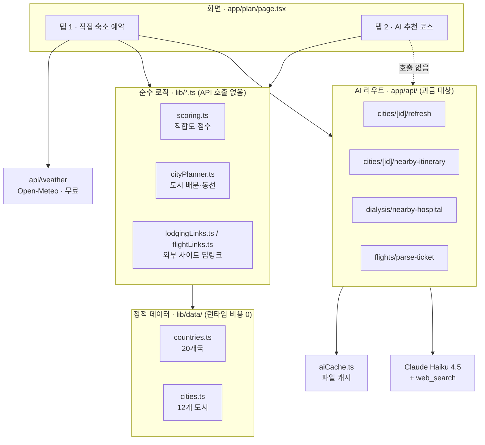

# 아키텍처 — 해외여행 일정 플래너

투석이 필요한 가족과 함께 가는 해외여행의 **적합도 판단 → 항공 → 도시·일정 → 숙소 → 투석병원**까지를 한 화면에서 처리하는 Next.js 앱.

실제 앱은 `travel-planner-app/` 안에 있다. 레포 루트의 `1.html`, `2.html`, `3.html`, `index.html`, `an.jpg`는 이 프로젝트 이전의 레거시 파일이라 앱과 무관하다.

## 디렉터리 구조

```
AHJ_repository/
├── ARCHITECTURE.md                       이 문서
├── 1.html · 2.html · 3.html · index.html · an.jpg   레거시 (앱과 무관)
└── travel-planner-app/                   실제 앱 · Vercel Root Directory
    ├── app/
    │   ├── layout.tsx                    루트 레이아웃
    │   ├── page.tsx                      랜딩 → /plan 유도
    │   ├── globals.css                   Tailwind v4
    │   ├── plan/page.tsx                 메인 화면 (클라이언트 컴포넌트)
    │   └── api/
    │       ├── weather/                  Open-Meteo 프록시 (무료, 키 불필요)
    │       ├── cities/                   GET ?country= → 도시 목록
    │       ├── cities/[cityId]/refresh/           AI 도시정보 업데이트
    │       ├── cities/[cityId]/nearby-itinerary/  AI 숙소 기반 일정 재구성
    │       ├── dialysis/nearby-hospital/          AI 숙소 근처 투석병원 검색
    │       └── flights/parse-ticket/              Claude Vision 항공권 OCR
    └── lib/
        ├── data/countries.ts             국가 큐레이션 (추천월·기후·투석병원)
        ├── data/cities.ts                도시 큐레이션 (명소·맛집·추천숙소)
        ├── scoring.ts                    적합도 점수 0~100 산출
        ├── cityPlanner.ts                도시 배분 + 일자별 동선 + 구글맵 링크
        ├── cityStore.ts                  파일 기반 도시 오버라이드 저장
        ├── aiCache.ts                    AI 응답 캐시 (중복 과금 방지)
        ├── lodgingLinks.ts               부킹닷컴 / 아고다 딥링크
        └── flightLinks.ts                스카이스캐너 / 네이버항공 딥링크
```

## 3계층 구조



### 1. 정적 데이터 계층 — `lib/data/`

미리 웹검색으로 조사해 하드코딩해둔 **배치 결과물**. 런타임 API 호출이 없으므로 비용이 들지 않고, Vercel의 읽기 전용 파일시스템에서도 안전하다.

| 파일 | 내용 |
| --- | --- |
| `countries.ts` | 20개국. 추천 여행월·환절기·기후 메모, 투석 인프라 등급, 실제 조사한 투석병원(URL·통역 지원 여부) |
| `cities.ts` | 12개 도시. 명소/점심/카페/저녁 스팟 + 추천 숙소 2~3곳 |

도시 커버리지: 일본 5(도쿄·오사카·교토·후쿠오카·삿포로), 대만 3(타이베이·가오슝·타이중), 베트남 2(다낭·호이안), 태국 1(방콕), 싱가포르 1.

대만·싱가포르의 추천 숙소는 **실제 투석병원 위치를 기준**으로 선정했다 — 가오슝·타이중 영관병원, 타이베이 난강 SunnyEase Clinic, 싱가포르 베독 Firstline Dialysis Centre.

### 2. 순수 로직 계층 — `lib/*.ts`

외부 호출 없이 계산만 하는 함수들. 테스트하기 쉽고 서버/클라이언트 어디서든 돌아간다.

- `scoring.ts` — 추천 여행월 + 단기 날씨 예보 + 투석 인프라를 합산해 0~100점과 경고 문구를 만든다.
- `cityPlanner.ts` — 박수에 따라 도시를 배분하고, `아침(숙소) → 오전명소 → 점심 → 카페 → 오후명소 → 저녁` 순서로 일자별 동선을 짠다. 같은 도시 체류 중 명소는 중복되지 않는다. 구글맵 경유지 링크도 여기서 조립한다.
- `lodgingLinks.ts` / `flightLinks.ts` — 항공·숙박 무료 API가 없어 가격을 지어내는 대신, 조건(날짜·인원·조식·가격대)을 실어 실제 예약 사이트로 보내는 딥링크를 만든다.

### 3. AI 라우트 계층 — `app/api/`

Claude Haiku 4.5 + 웹검색을 쓰는 **4개 라우트만 과금 대상**이다. 전부 `maxDuration = 60`(Vercel 기본 타임아웃이 짧아 웹검색이 끊기는 문제 대응)과 `aiCache.ts` 파일 캐시(같은 입력 재조회 시 재과금 방지)를 적용했다.

| 라우트 | 역할 |
| --- | --- |
| `cities/[cityId]/refresh` | 도시의 명소·맛집을 추가 조사해 기존 목록과 중복 없이 덧붙임 |
| `cities/[cityId]/nearby-itinerary` | 실제 예약한 숙소 주소 기준 도보 30~40분권으로 일정 전체 재구성 |
| `dialysis/nearby-hospital` | 숙소 주소에서 가장 가까운 투석 가능 병원 검색 |
| `flights/parse-ticket` | 항공권 스크린샷에서 도착·출발 시각 추출 (Claude Vision) |

`api/weather`는 Open-Meteo 프록시라 키도 비용도 없다. `api/cities`는 정적 데이터 + 오버라이드를 합쳐 돌려줄 뿐이다.

## 화면 흐름

`/plan` 한 페이지에 전부 들어있고, 결과 화면에서 탭으로 두 가지 방식이 갈린다.

1. **국가 + 여행 날짜 입력** (+ 투석 필요 여부와 요일 선택) → 적합도 점수와 경고
2. **항공권** — 스카이스캐너 / 네이버항공 딥링크. 예약 후 항공권 스크린샷을 올리면 실제 도착·출발 시각이 일정에 반영된다
3. **탭 분기**
   - **직접 숙소 예약** — 방문할 도시를 직접 고르고, 예약한 숙소 주소를 넣으면 그 주소 기준으로 일정과 투석병원을 다시 찾아준다 *(AI 호출 있음)*
   - **AI 추천 코스** — 배치 데이터만으로 최적 코스를 짜고, 그 코스 안에 맞는 숙소를 추천한다 *(AI 호출 0, 즉시 응답)*
4. **투석 가능 병원** — 국가 단위로 미리 조사해둔 병원 목록(통역 지원 여부 포함)을 항상 함께 보여준다

## 기술 스택

Next.js 16.3.3 (App Router, Turbopack) · React 19 · TypeScript · Tailwind CSS v4 · Zod · `@anthropic-ai/sdk`

## 배포

Vercel. **Root Directory는 `travel-planner-app`**, **Framework Preset은 Next.js**로 지정해야 한다(Other로 두면 정적 파일로 취급해 모든 경로가 404가 난다). Production Branch는 작업 브랜치로 맞춰져 있다.

AI 기능을 쓰려면 `ANTHROPIC_API_KEY`가 필요하다 — 로컬은 `travel-planner-app/.env.local`, 배포는 Vercel 환경변수에 넣는다. 키가 없으면 AI 라우트만 501로 안내를 돌려주고 나머지 기능은 정상 동작한다.

## 알려진 한계

- **파일 기반 저장** — `cityStore.ts`와 `aiCache.ts`는 `data/*.json`에 쓴다. Vercel 서버리스는 인스턴스 파일시스템이 휘발성이라 조회 간 유지가 보장되지 않는다. 영구 보관이 필요해지면 DB로 옮겨야 한다.
- **딥링크 의존** — 항공·숙박 가격은 무료 API가 없어 예약 사이트로 넘긴다. 사이트 측 파라미터 정책이 바뀌면 조건이 안 넘어갈 수 있다.
- **투석 예약 확정은 수동** — 병원 목록과 통역 지원 여부까지만 제공한다. 실제 해당 날짜 투석이 가능한지는 사용자가 직접 병원에 확인해야 한다.
